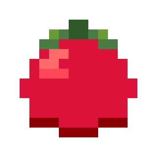

<div align="center">



# 🍅 Otamot

**A minimal, focused Pomodoro timer that stays out of your way**

*Write notes. Stay focused. Get things done.*

[Download Latest Release](https://github.com/samrocksc/otamot/releases/latest) · [Report Bug](https://github.com/samrocksc/otamot/issues) · [Request Feature](https://github.com/samrocksc/otamot/issues)

</div>

---

## ✨ What is Otamot?

**Otamot** is "tomato" spelled backwards — a fitting name for a fresh take on the [Pomodoro Technique](https://en.wikipedia.org/wiki/Pomodoro_Technique).

It's a simple, elegant timer that helps you:
- ⏱️ **Stay focused** with timed work sessions (default: 25 minutes)
- ☕ **Take breaks** with automatic break timers (default: 5 minutes)
- 📝 **Capture thoughts** in Markdown without leaving the app
- 💾 **Auto-save notes** when your session ends

No clutter. No distractions. Just you and your work.

---

## 🚀 Quick Start

### Download

Grab the latest release for your platform:

| Platform | Download |
|----------|----------|
| **macOS (Apple Silicon)** | `otamot-macos-aarch64.tar.gz` |
| **macOS (Intel)** | `otamot-macos-x86_64.tar.gz` |
| **Linux (x64)** | `otamot-linux-x86_64.tar.gz` |
| **Linux (ARM64)** | `otamot-linux-aarch64.tar.gz` |

Extract and run:
```bash
tar -xzf otamot-*.tar.gz
./otamot
```

### Build from Source

```bash
git clone https://github.com/samrocksc/otamot.git
cd otamot
cargo run
```

---

## 🎮 How to Use

### Basic Controls

| Button | What it does |
|--------|--------------|
| **START / PAUSE** | Begin or pause your work session |
| **RESET** | Return to the beginning of your work session |
| **SKIP** | Jump straight to break time |

### Notes

Toggle notes on with the **📝 Notes: OFF** button. When enabled:

1. **Write in Markdown** — Use `#`, `##`, `-`, and `**` for formatting
2. **Preview anytime** — Press `Ctrl+P` to switch between Edit and Preview modes
3. **Save manually** — Click **💾 Save Notes** when you're ready
4. **Auto-save** — Notes are saved automatically when your work session ends

### Settings

Click **⚙ Settings** to customize:
- Work duration (1–60 minutes)
- Break duration (1–30 minutes)
- Notes directory (where your notes are saved)

---

## 📁 Where Does Everything Go?

Otamot keeps things organized:

```
~/.config/otamot/
├── settings.json        # Your preferences
└── notes/               # Your session notes
    ├── 02-27-2026-11-05-11-30.md
    └── 02-27-2026-14-00-14-25.md
```

### Note File Format

Notes are saved as `MM-DD-YYYY-Start-End.md` with helpful frontmatter:

```markdown
---
title: "Pomodoro Session"
date: 2026-02-27 11:30:00
start_time: 2026-02-27 11:05:00
end_time: 2026-02-27 11:30:00
duration_minutes: 25
mode: work
sessions_completed: 3
tags:
  - pomodoro
  - work
---

## What I worked on today

- Finished the API integration
- Wrote unit tests for auth module
- Documented the new endpoints

### Blockers

Need to follow up with design team on icons.
```

---

## 🎯 Philosophy

Otamot was built with a few simple principles:

1. **Minimal but not bare** — Everything you need, nothing you don't
2. **Keyboard-friendly** — `Ctrl+P` to toggle preview, more coming soon
3. **Your data, your way** — Plain Markdown files you own forever
4. **Dark by default** — Easy on the eyes during late-night sessions

---

## 🛠️ Built With

- [Rust](https://www.rust-lang.org/) — Fast, safe, reliable
- [eframe/egui](https://github.com/emilk/egui) — Immediate mode GUI
- [pulldown-cmark](https://github.com/raphlinus/pulldown-cmark) — Markdown parsing

---

## 🗺️ Roadmap

Things we're planning:

- [ ] Desktop notifications when timer completes
- [ ] System tray integration
- [ ] Sound notifications
- [ ] Dark/light theme toggle
- [ ] Statistics dashboard (sessions per day, week, month)
- [ ] Custom keyboard shortcuts
- [ ] Export notes to other formats

*Have an idea? [Open an issue](https://github.com/samrocksc/otamot/issues)!*

---

## 🤝 Contributing

Contributions are welcome! Whether it's:

- 🐛 Bug fixes
- ✨ New features
- 📝 Documentation improvements
- 🎨 UI enhancements

Just fork the repo, make your changes, and open a Pull Request.

---

## 📜 License

MIT License — do whatever you'd like with it.

---

## 💙 Acknowledgments

- [The Pomodoro Technique](https://en.wikipedia.org/wiki/Pomodoro_Technique) by Francesco Cirillo
- [eframe/egui](https://github.com/emilk/egui) for making cross-platform GUIs a joy
- Everyone who contributes to this project

---

<div align="center">

**Happy focusing! 🍅**

*Made with ❤️ by [samrocksc](https://github.com/samrocksc)*

</div>
